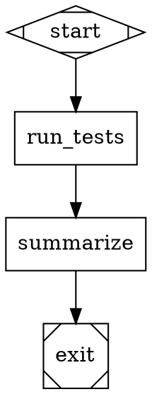

# Kilroy

Kilroy is a local-first CLI for running StrongDM-style Attractor pipelines in a git repo.

High-level flow:

1. Convert English requirements to a Graphviz DOT pipeline (`attractor ingest`).
2. Validate graph structure and semantics (`attractor validate`).
3. Execute node-by-node with coding agents in an isolated git worktree (`attractor run`).
4. Resume interrupted runs from logs, CXDB, or run branch (`attractor resume`).

## What Is CXDB?

CXDB is the execution database Kilroy uses for observability and recovery.

- Kilroy records typed run events (run started, stage finished, checkpoint saved, run completed/failed) to CXDB.
- Kilroy stores artifacts (logs, outputs, archives) in CXDB blobs.
- Resume-from-CXDB works because run metadata (like `logs_root` and checkpoint pointers) is written into this timeline.

Short version: git branch is code history; CXDB is run history.

## What Attractor Means Here

An Attractor pipeline is a `digraph` where:

- Nodes are stages (`start`, `exit`, codergen tasks, conditionals, human gates, tool steps, parallel/fan-in).
- Edges define control flow and optional conditions/retry behavior.
- The engine checkpoints after each stage and routes to the next stage deterministically.

In this repo, each completed node also creates a git checkpoint commit on a run branch.

## StrongDM Attractor vs Kilroy Implementation

This implementation is based on the Attractor specification by StrongDM at `https://github.com/strongdm/attractor`. Here's how Kilroy differs

| Area | From StrongDM Attractor Specs | Kilroy-Specific in This Repo |
|---|---|---|
| Graph DSL + engine semantics | DOT schema, handler model, edge selection, retry, conditions, context fidelity | Concrete Go engine implementation details and defaults |
| Coding-agent loop | Session model, tool loop behavior, provider-aligned tool concepts | Local tool execution wiring and CLI/API backend routing choices |
| Unified LLM model | Provider-neutral request/response/tool/streaming contracts | Concrete provider adapters and environment wiring |
| Provider support | Conceptual provider abstraction | Provider plug-in runtime with built-ins: OpenAI, Anthropic, Google, Kimi, ZAI |
| Backend selection | Spec allows flexible backend choices | Backend is mandatory per provider (`api`/`cli`), no implicit defaults |
| Checkpointing + persistence | Attractor/CXDB contracts | Required git branch/worktree/commit-per-node and concrete artifact layout |
| Ingestion | Ingestor behavior described in spec docs | `attractor ingest` implementation: Claude CLI + `english-to-dotfile` skill |

## Prerequisites

- Go 1.25+
- Git repo with at least one commit
- Clean working tree before `attractor run`/`resume`
- CXDB reachable over binary + HTTP endpoints (or configure `cxdb.autostart`)
- Provider access for any provider used in your graph
- `claude` CLI for `attractor ingest` (or set `KILROY_CLAUDE_PATH`)

## Quickstart

### 1) Build

```bash
go build -o kilroy ./cmd/kilroy
```

### 2) Generate a pipeline from English

```bash
./kilroy attractor ingest -o pipeline.dot "Solitaire plz"
```

Notes:

- Ingest auto-detects `skills/english-to-dotfile/SKILL.md` under `--repo` (default: cwd).
- Use `--skill <path>` if your skill file is elsewhere.

### 3) Validate the pipeline

```bash
./kilroy attractor validate --graph pipeline.dot
```

If you want to author a graph manually instead of using `ingest`, this minimal example is valid:



### 4) Create `run.yaml`

```yaml
version: 1

repo:
  path: /absolute/path/to/target/repo

cxdb:
  binary_addr: 127.0.0.1:9009
  http_base_url: http://127.0.0.1:9010
  autostart:
    enabled: true
    # argv form; use "sh -lc" if you need shell features.
    command: ["sh", "-lc", "./scripts/start-cxdb.sh"]
    wait_timeout_ms: 20000
    poll_interval_ms: 250
    ui:
      enabled: true
      command: ["sh", "-lc", "./scripts/start-cxdb-ui.sh"]
      url: "http://127.0.0.1:9020"

llm:
  cli_profile: real
  providers:
    openai:
      backend: cli
    anthropic:
      backend: api
    google:
      backend: api
    kimi:
      backend: api
      api:
        protocol: anthropic_messages
        api_key_env: KIMI_API_KEY
        base_url: https://api.kimi.com/coding
        path: /v1/messages
        profile_family: openai
    zai:
      backend: api
      api:
        protocol: openai_chat_completions
        api_key_env: ZAI_API_KEY
        base_url: https://api.z.ai
        path: /api/coding/paas/v4/chat/completions
        profile_family: openai

modeldb:
  openrouter_model_info_path: /absolute/path/to/kilroy/internal/attractor/modeldb/pinned/openrouter_models.json
  openrouter_model_info_update_policy: on_run_start
  openrouter_model_info_url: https://openrouter.ai/api/v1/models
  openrouter_model_info_fetch_timeout_ms: 5000

git:
  require_clean: true
  run_branch_prefix: attractor/run
  commit_per_node: true
```

Important:

- Any provider referenced by a node's `llm_provider` must have `llm.providers.<provider>.backend` configured.
- `cxdb.binary_addr`, `cxdb.http_base_url`, and `modeldb.openrouter_model_info_path` are required.
- Deprecated compatibility: `modeldb.litellm_catalog_*` keys are still accepted for one release.
- Config can be YAML or JSON.

### 5) Run the pipeline

Real run (recommended/default profile):

```bash
unset KILROY_CODEX_PATH KILROY_CLAUDE_PATH KILROY_GEMINI_PATH
./kilroy attractor run --graph pipeline.dot --config run.yaml
```

Explicit test-shim run (for local fake-provider testing only):

```yaml
llm:
  cli_profile: test_shim
  providers:
    openai:
      backend: cli
      executable: /absolute/path/to/fake-codex
```

```bash
./kilroy attractor run --graph pipeline.dot --config run.yaml --allow-test-shim
```

On success, stdout includes:

- `run_id=...`
- `logs_root=...`
- `worktree=...`
- `run_branch=...`
- `final_commit=...`
- `cxdb_ui=...` (when `cxdb.autostart.ui.url` is configured)

If autostart is used, startup logs are written under `{logs_root}`:

- `cxdb-autostart.log`
- `cxdb-ui-autostart.log`

## CXDB Autostart Notes

- `cxdb.autostart.command` is required when `cxdb.autostart.enabled=true`.
- `cxdb.autostart.ui.url` is optional; when omitted, Kilroy auto-detects it from `cxdb.http_base_url` if that endpoint serves HTML UI.
- `cxdb.autostart.ui.command` is optional; Kilroy starts UI when a command is provided (config or `KILROY_CXDB_UI_COMMAND`).
- Kilroy injects these env vars for autostart commands:
  - `KILROY_RUN_ID`
  - `KILROY_CXDB_HTTP_BASE_URL`
  - `KILROY_CXDB_BINARY_ADDR`
  - `KILROY_LOGS_ROOT`
  - `KILROY_CXDB_UI_URL` (UI command only)
- You can also set:
  - `KILROY_CXDB_UI_URL` to force the printed UI link.
  - `KILROY_CXDB_UI_COMMAND` as a shell command used to start UI by default.
- If CXDB is unreachable and autostart is disabled, Kilroy fails fast with a remediation hint.

## Provider Setup

Provider runtime architecture:

- Providers are protocol-driven and configured under `llm.providers.<provider>`.
- Built-ins include `openai`, `anthropic`, `google`, `kimi`, and `zai`.
- Provider aliases: `gemini`/`google_ai_studio` -> `google`, `moonshot`/`moonshotai` -> `kimi`, `z-ai`/`z.ai` -> `zai`.
- CLI contracts are built-in for `openai`, `anthropic`, and `google`.
- `kimi` and `zai` are API-only in this release.

CLI backend command mappings:

- `openai` -> `codex exec --json --sandbox workspace-write ...`
- `anthropic` -> `claude -p --output-format stream-json ...`
- `google` -> `gemini -p --output-format stream-json --yolo ...`

Execution policy:

- `llm.cli_profile` defaults to `real`.
- In `real`, Kilroy uses canonical binaries (`codex`, `claude`, `gemini`) and rejects `KILROY_CODEX_PATH`, `KILROY_CLAUDE_PATH`, `KILROY_GEMINI_PATH`.
- For fake/shim binaries, set `llm.cli_profile: test_shim`, configure `llm.providers.<provider>.executable`, and run with `--allow-test-shim`.

API backend environment variables:

- OpenAI: `OPENAI_API_KEY` (`OPENAI_BASE_URL` optional)
- Anthropic: `ANTHROPIC_API_KEY` (`ANTHROPIC_BASE_URL` optional)
- Google: `GEMINI_API_KEY` or `GOOGLE_API_KEY` (`GEMINI_BASE_URL` optional)
- Kimi (Coding API key): `KIMI_API_KEY`
- ZAI: `ZAI_API_KEY`

Kimi compatibility note:

- Built-in `kimi` defaults target Kimi Coding (`anthropic_messages`, `https://api.kimi.com/coding`).
- If you use Moonshot Open Platform keys instead, override `kimi.api` to `protocol: openai_chat_completions`, `base_url: https://api.moonshot.ai`, `path: /v1/chat/completions`.

## Run Artifacts

Typical run-level artifacts under `{logs_root}`:

- `graph.dot`
- `manifest.json`
- `checkpoint.json`
- `final.json`
- `run_config.json`
- `modeldb/openrouter_models.json`
- `run.tgz` (run archive excluding `worktree/`)
- `worktree/` (isolated execution worktree)

Typical stage-level artifacts under `{logs_root}/{node_id}`:

- `prompt.md`
- `response.md`
- `status.json`
- `stage.tgz`
- CLI backend extras: `cli_invocation.json`, `stdout.log`, `stderr.log`, `events.ndjson`, `events.json`, `output_schema.json`, `output.json`
- API backend extras: `api_request.json`, `api_response.json`, `events.ndjson`, `events.json`

## Commands

```text
kilroy attractor run [--allow-test-shim] [--force-model <provider=model>] --graph <file.dot> --config <run.yaml> [--run-id <id>] [--logs-root <dir>]
kilroy attractor resume --logs-root <dir>
kilroy attractor resume --cxdb <http_base_url> --context-id <id>
kilroy attractor resume --run-branch <attractor/run/...> [--repo <path>]
kilroy attractor validate --graph <file.dot>
kilroy attractor ingest [--output <file.dot>] [--model <model>] [--skill <skill.md>] <requirements>
```

`--force-model` can be passed multiple times (for example, `--force-model openai=gpt-5.2-codex --force-model google=gemini-3-pro-preview`) to override node model selection by provider.
Supported providers are `openai`, `anthropic`, `google`, `kimi`, and `zai` (aliases accepted).

Additional ingest flags:

- `--repo <path>`: repo root to run ingestion from (default: cwd)
- `--no-validate`: skip post-generation DOT validation

Exit codes:

- `0`: run/resume finished with final status `success`, or validate succeeded
- `1`: command failed, validation error, or final status was not `success`

## Skills Included In This Repo

- `skills/using-kilroy/SKILL.md`: operational workflow for ingest/validate/run/resume.
- `skills/english-to-dotfile/SKILL.md`: requirements-to-DOT generation instructions.

## References

- StrongDM Attractor specs: `docs/strongdm/attractor/`
- Attractor spec: `docs/strongdm/attractor/attractor-spec.md`
- Coding Agent Loop spec: `docs/strongdm/attractor/coding-agent-loop-spec.md`
- Unified LLM spec: `docs/strongdm/attractor/unified-llm-spec.md`
- Kilroy metaspec: `docs/strongdm/attractor/kilroy-metaspec.md`
- Ingestor spec: `docs/strongdm/attractor/ingestor-spec.md`
- CXDB project: <https://github.com/strongdm/cxdb>

## License

MIT. See `LICENSE`.
