# English to Dotfile

## Overview

This skill converts English requirements into a valid Attractor `.dot` graph.

Core principle:
- Prefer a validated template for topology (node shapes, edges, routing), over novel graph design.
- The template defines structure only — it contains no prompt text. Every prompt must be composed from scratch based on the actual project materials.
- Optimize for a graph that runs reliably, not a graph that looks clever.

Primary references for behavior:
- `docs/strongdm/attractor/ingestor-spec.md`
- `docs/strongdm/attractor/attractor-spec.md`
- `skills/english-to-dotfile/reference_template.dot`

## When to Use

Use this skill when:
- The user wants a DOT pipeline from plain English requirements (or a spec).
- The user wants to revise or improve an existing Attractor DOT pipeline.
- The output target is `kilroy attractor ingest` or `kilroy attractor run`.
- You need to choose models/providers and routing structure safely.

Do not use this skill when:
- The user asked you to implement software directly instead of generating a DOT graph.

## Non-Negotiable Rules

1. Programmatic output must be DOT only.
- Output starts with `digraph` and ends with `}`.
- No markdown fences, preambles, or sentinel strings.

2. Never emit non-DOT terminal responses in programmatic mode.
- Do not output `NEEDS_CLARIFICATION`, `DOT_VALIDATION_FAILED`, or similar text as final output.
- If uncertainty remains, choose best-evidence assumptions and still emit DOT.

3. In non-interactive/programmatic mode, do not ask follow-up questions.
- Resolve ambiguity from repository evidence and continue.
- Default to `medium` option behavior when selection is needed.

4. Ensure every codergen node resolves a provider/model.
- For `shape=box`, `llm_provider` and `llm_model` must resolve via explicit attrs or `model_stylesheet`.

5. Honor explicit topology constraints.
- If user says `no fanout` or `single path`, do not emit fan-out/fan-in branches.

6. Treat user-provided `goal`/spec/DoD as authoritative when explicitly labeled.
- If the user says “this is the goal/spec/DoD” (or provides a file path and declares it is the spec/DoD), use it verbatim. Do not rewrite, summarize, “clean up”, or normalize punctuation/whitespace.
- For DOT embedding, escape only as required by DOT string syntax so the **rendered text content** is identical to what the user provided.
- If the provided text is incomplete, keep it verbatim and create a separate “gaps/assumptions” artifact rather than rewriting the source text.

7. Ensure `expand_spec` receives the user’s full input verbatim.
- When generating a DOT graph from user text (especially transcripts), include the **entire user-provided input** verbatim in the `expand_spec` prompt under clear delimiters.
- Do not summarize, rephrase, or “clean up” the user’s input in this verbatim block (DOT-escape only).
- If the user explicitly provides a spec/DoD as a repo file path, `expand_spec` should read the file as the authoritative source; still include the original user message verbatim so the spec derivation is auditable.

8. Treat prerequisite/tool gates as real gates.
- If a `shape=parallelogram` node can fail (toolchain, build, format, file checks), route on `outcome=success` and route failures explicitly.
- Do not wire prerequisite checks with unconditional pass-through that bypasses their outcome.

9. Do not bypass actionable node outcomes.
- For `shape=box` and `shape=parallelogram` nodes, avoid unconditional "next stage" edges that ignore success/fail status.
- Use check/conditional nodes (or explicit conditioned edges) so progress depends on outcome.

10. Keep status/handoff contracts exact across stages.
- Every `shape=box` prompt must mention both `$KILROY_STAGE_STATUS_PATH` and `$KILROY_STAGE_STATUS_FALLBACK_PATH`.
- Every `shape=box` prompt must define success and failure/retry outcome behavior.
- If a node reads `.ai/<name>.md`, an upstream node must write that exact same path (no filename drift).

11. Use `tool_command` for `shape=parallelogram` nodes.

## Workflow

### Phase 0: Determine Execution Mode and Constraints

Determine mode first:
- Interactive mode: conversation with user where you can ask one disambiguation question if needed.
- Programmatic mode: CLI ingest or any machine-parsed context where you cannot ask questions.
- If unsure, treat as programmatic mode.

Extract hard constraints from user text:
- Required providers/models
- Parallelism intent (`no fanout`, `3-way`, `consensus`)
- Runtime backend constraints (for example CLI-only/API-only), applied via run config alignment rather than DOT structure
- Cost/quality intent (`fast`, `max thinking`, etc.)

### Phase 1: Resolve Ambiguity with Repo Evidence

Use a short repo triage before asking anything:
- Inspect top-level structure and obvious docs.
- Search ambiguous tokens with `rg`.
- Prefer concrete repo evidence over guesswork.

Interactive ambiguity rule:
- Ask at most one disambiguation question when required to proceed.
- Ask only identity/meaning questions, not preference questions.

Programmatic ambiguity rule:
- Do not ask questions.
- Use strongest evidence, record assumptions in graph prompts/artifacts, and continue.

### Phase 2: Select Topology (Template-First)

Default strategy:
- Start from `skills/english-to-dotfile/reference_template.dot` for topology: node shapes, edges, routing patterns, subgraph structure.
- The template contains no prompt text — only structural comments listing what each prompt must address. You must compose every prompt from scratch based on the project's spec, DoD, and repo contents.
- Keep one code-writing implementation node.
- Use parallelism for planning/review thinking stages, not code writes.

Constraint fast path (`no fanout`):
- Use a compact single-path loop.
- Keep `implement -> check_implement -> deterministic verify/check -> semantic verify/review -> postmortem`.
- Do not include `plan_a/b/c`, `review_a/b/c`, `component`, or `tripleoctagon` nodes.

Auto-fix nodes:
- When the language has a canonical formatter or auto-fixer (e.g. `gofmt -w .`, `cargo fmt`, `black .`, `prettier --write .`), insert a `shape=parallelogram` auto-fix node before the corresponding verify gate (e.g. `fix_fmt -> verify_fmt`). This makes the verify gate a pure assertion and avoids wasting hill-climbing iterations on trivially fixable formatting failures.

Spec source rule:
- Prefer an existing spec source (a user-provided path, `docs/`, etc.).
  - Either wire downstream prompts to read it directly, or copy it verbatim into the canonical `.ai/spec.md` via `expand_spec` so the rest of the pipeline has a stable path.
- If no adequate spec exists, include `expand_spec` early. Make it idempotent: reuse an adequate `.ai/spec.md` if present (optionally do form-only cleanup when it is not explicitly user-declared verbatim); otherwise generate it from `$goal` + repo evidence.

Loop and routing rules:
- Keep explicit outcome-based conditions (`outcome=...`).
- Condition expressions support `=`, `!=`, and `&&`. Do not use `||`, `<`, or `>`.
- Inner retry restarts (`loop_restart=true`) are only for transient infra failures (`context.failure_class=transient_infra`).
- Deterministic failures should route to repair/postmortem, not blind restarts.
- For `goal_gate=true` nodes routing to terminal, use `condition="outcome=success"` or `condition="outcome=partial_success"`.
- If a node has conditional outgoing edges, add one unconditional fallback edge (no `condition`) to avoid routing gaps.
- For prerequisite/tool gates and implementation stages, route success/failure explicitly before advancing; do not rely on unconditional edges to progress.
- For failure back-edges from `shape=diamond` nodes, include `context.failure_class` in the failure condition and keep deterministic fallback routing explicit.
- Postmortem recovery should be domain-routed with custom outcomes:
  `impl_repair -> implement`, `needs_replan -> plan_fanout`,
  `needs_toolchain -> check_toolchain`, plus one unconditional fallback to
  `implement`.
- Add explicit handling for postmortem execution failure:
  `postmortem -> check_toolchain [condition="outcome=fail && context.failure_class=transient_infra"]`.

#### Deterministic vs Transient Failures (Failure Classification)

Attractor’s retry and cycle-breaking semantics depend on `failure_class` (see `docs/strongdm/attractor/attractor-spec.md`).

Use these definitions:
- **Deterministic** (`failure_class=deterministic`): The failure is not expected to be resolved by automatic retry/backoff; it requires a different approach or changed inputs (code/config/graph/prompt/context). This is about *retryability*, not whether the underlying system is probabilistic. Examples: tests failing due to incorrect code, compilation errors, missing required files, invalid config, auth/permission errors, invalid request/model-not-found, LLM-generated changes that fail build/tests and need repair.
- **Transient infra** (`failure_class=transient_infra`): A wait-and-retry might succeed. Examples: rate limits, timeouts, network errors, provider 5xx/unavailability.
- **Structural** (`failure_class=structural`): The pipeline/graph itself is broken (usually caught by validation). Examples: missing start/exit, invalid condition syntax, missing required node attributes.
- **Canceled** (`failure_class=canceled`): The run was canceled; do not treat as retryable or as a deterministic cycle signal.
- **Budget exhausted** (`failure_class=budget_exhausted`): Failure due to budget/limits; only retry if there is a clear escalation path (smaller scope, different model, explicit user approval).
- **Compilation loop** (`failure_class=compilation_loop`): Repeated build/test failure patterns that indicate an unproductive loop; only retry if you change approach (repair/escalate), not by blind restart.

Heuristic:
- If success is plausible after waiting/retrying the same action, it’s usually `transient_infra`.
- If success requires changing code/config/graph/prompt/context, it’s usually `deterministic` (or `structural` for pipeline-definition problems), even if the LLM could “get lucky” on a re-run.

Common hill-climbing case (“good work, not done yet — keep going”):
- Prefer modeling “needs another iteration” as `status=fail` with a non-transient `failure_class` (usually `deterministic`, sometimes `compilation_loop`), then route to repair/postmortem/re-plan nodes that drive the next attempt.
- Avoid using `status=retry` for hill-climbing loops unless you explicitly want the engine to immediately re-run the *same node* via the retry policy (as opposed to routing to a different node for repair).
- `failure_class` is only relevant when `status=fail` or `status=retry`; `status=success` should proceed normally.

Routing implications:
- Use `loop_restart=true` only for “wipe the run and start fresh” recovery, and only when the failure is clearly retryable infra (`context.failure_class=transient_infra`).
- For everything else (especially `deterministic` and `structural`), route to a non-restart repair loop (postmortem/re-plan/implement) so the next attempt makes progress instead of restarting blindly.

Guardrails:
- Do not set `allow_partial=true` on the primary implementation node in the hill-climbing profile.
- Do not add `max_agent_turns` by default.
- Do not add visit-count loop breakers by default.

### Phase 3: Select Models and Runtime Alignment

#### 3.1 Read Preferences Defaults

Load preferences in this order:
1. Skill-local sibling file: `skills/english-to-dotfile/preferences.yaml` (repo path).
2. If skill runs from an agent-skill directory, also check sibling `preferences.yaml` next to `SKILL.md`.

Use values as defaults only:
- `defaults.models.default|hard|verify|review`

#### 3.2 Detect What Is Executable

For each provider, determine viable runtime paths for the current project:
- Prefer evidence from run config (`llm.providers.*.backend`, `llm.cli_profile`) when available.
- If no run config is available, keep DOT backend-agnostic and only ensure provider/model choices are plausible.
- Include providers configured in run config.

Do not select providers that are not executable in the current environment.

#### 3.3 Resolve Candidate Models from Kilroy ModelDB/OpenRouter Catalog

Catalog preference order:
1. Run-config `modeldb.openrouter_model_info_path` or run snapshot.
2. `internal/attractor/modeldb/pinned/openrouter_models.json`.
3. Explicit user model IDs when catalog is unavailable.

Interpretation rules:
- Treat catalog as metadata guidance, not a strict allowlist.
- Honor explicit user model IDs when feasible.
- `current`/`cheapest` are computed from currently executable candidates.

#### 3.4 Build Option Set

Define three plans:
- Low: lowest-cost viable plan, reduced parallelism.
- Medium: default plan, balanced quality/cost, template-aligned.
- High: strongest available plan, cross-provider fan-out when available.

Interactive mode:
- Present low/medium/high once and wait for selection/overrides.

Programmatic mode:
- Do not print options table.
- Choose medium automatically and continue.

Encoding rule:
- Put model/provider assignments in `model_stylesheet`.
- If high mode uses fan-out, assign distinct providers to `branch-a`, `branch-b`, `branch-c` when possible.
- Do not encode backend routing (`cli` vs `api`) in DOT topology; backend selection belongs to run config/runtime.

### Phase 4: Write Node Prompts and File Handoffs

The reference template contains NO prompt text — only structural comments listing what each prompt must address. You must compose every prompt from scratch based on the project's spec, DoD, and repo contents. The template's comments are minimum requirements, not starting text.

Every generated codergen prompt must include:
1. What to do — specific to the project's domain, deliverables, and constraints, derived from reading the spec and DoD.
2. What files to read — both `.ai/` artifacts and specific repo files relevant to the node's task.
3. What files to write.
4. Acceptance checks — specific to the project's acceptance criteria, not generic references to "the DoD."
5. Explicit status/outcome contract.

Prompt content rule — orient, don't duplicate:

Every codergen prompt lists files for the runtime LLM to read, and the runtime LLM reads those files in full. This means anything you write in the prompt that also appears in those files is redundant — the LLM already has it. Worse, after a repair iteration the files may have changed but the prompt hasn't, so the prompt's copy is now stale and misleading.

The value a prompt adds is context the files can't provide on their own: why this node exists in the pipeline, what to prioritize, where projects like this one tend to go wrong, and what to do differently on a repair iteration vs a fresh run. A developer reading a spec knows what to build, but a good tech lead adds "watch out for X, do Y before Z, and if you're fixing a bug don't rewrite the module." That's what a prompt should be.

A practical test: if a prompt approaches the length of the files it references, it's almost certainly restating their content rather than orienting the reader. A good prompt for a 600-line spec is 30-50 lines.

Exception: `expand_spec` must include the user's full input verbatim (per the verbatim input requirement below), because no spec file exists yet.

Mandatory status contract text (or equivalent) in generated prompts:
- Write status JSON to `$KILROY_STAGE_STATUS_PATH` (absolute path).
- If unavailable, use `$KILROY_STAGE_STATUS_FALLBACK_PATH`.
- Do not write nested `status.json` files after `cd`.
- Use the canonical schema: `{"status":"..."}`
- Routing conditions use `condition="outcome=..."` on edges; `outcome` is set to the stage's `status` value.
- Require both variable names to appear verbatim in each codergen prompt.

Auto-fix tool commands:
- For each deterministic verify gate that has a language-canonical auto-fix command (formatter, import sorter, linter with `--fix`), populate the preceding fix node's `tool_command` with that command.

Failure payload contract:
- For `status=fail` or `status=retry`, include both `failure_reason` and `details`.
- For deterministic verification failures, include `failure_class` where applicable.

Handoff rules:
- Use `.ai/*` files for substantial inter-node artifacts (plans, reviews, postmortems).
- Keep file reads/writes consistent: every read path must have an upstream producer or explicit repo-source justification.
- Use exact file identity for handoffs (same basename/path), not "similar" names.

### Goal (`graph.goal` / `$goal`) Contract (Required)

In Attractor, the graph-level `goal` attribute is:
- Exposed as `$goal` in node prompts via simple string replacement (the only built-in prompt variable).
- Mirrored into the run context as `graph.goal`.

Therefore, `$goal` is the primary “source of truth” for what the pipeline is trying to do.

How to create `goal` optimally:
1. **If the user explicitly provides it as the goal:** use it verbatim (escape only as required for DOT).
2. **Otherwise, write it as a noun phrase describing the thing/outcome**, not a command or a full sentence. This avoids awkward prompts when `$goal` is pasted into sentences (for example “Create a plan for $goal”).
   - Bad: “We'll build a calculator.”
   - Good: “a Python-based calculator app for blind students taking high school math”
3. **Make it durable for the whole graph.** Because `goal` is graph-level (not node-level), every node may reference the same text. Avoid ephemeral, step-specific goals.
   - Bad: “Fix the bug in line 40 first.”
   - Good: “a login system that handles empty passwords gracefully.”
4. **Prompt phrasing should assume noun-phrase goals.** Prefer prompt templates like “Create a plan for $goal” / “Implement $goal”. If an explicitly user-provided goal is not a noun phrase, avoid grammar-dependent prompt patterns and use a neutral preface like `Goal: $goal` at the top of the prompt.

Implementation note (important):
- If the user did not provide a goal, derive `graph.goal` during DOT generation (ingest/skill time) from the provided materials + repo evidence.
- Do not design a runtime pipeline that “computes `$goal` after `expand_spec`” — `$goal` is graph-level and static during execution.

Goal adequacy rubric (keep it short, but complete enough to drive `expand_spec`):
- States the deliverable/outcome (“what exists when done”) and the repo/location it applies to (path/module/service if known).
- May include durable high-level scope/non-goals if they are truly objective-defining.
- Do **not** encode topology or execution constraints in `$goal` (for example `no fanout`, provider/model routing, CLI-vs-API). Those belong in the DOT structure and/or the spec.
- Avoids turning into a full spec or an implementation plan. Detailed requirements belong in `.ai/spec.md`.

### Spec Expansion (`expand_spec`) Contract (Required when no adequate spec file exists)

The pipeline should converge on a canonical, file-based spec that downstream nodes can read (default: `.ai/spec.md`).

Template alignment:
- The reference template assumes downstream nodes read `.ai/spec.md`. If you choose a different spec path, update all downstream prompts consistently.
- After `expand_spec` runs, downstream nodes should treat `.ai/spec.md` as the authoritative spec (not `$goal`).

Behavior requirements for `expand_spec`:
1. **Reuse first:** If a spec already exists (for example `.ai/spec.md` or a user-provided path), prefer reusing it.
   - If the user explicitly labeled the spec (“this is the spec”), copy/use it verbatim (no rewriting). If a canonical path is needed, copy it verbatim into `.ai/spec.md`.
   - If the spec exists but is messy, do form-only cleanup (headings/whitespace) without changing meaning.
2. **Expand only when needed:** If the available spec is missing critical information, create a separate addendum (for example `.ai/spec_gaps.md`) listing gaps and assumptions. Do not overwrite a user-declared verbatim spec.
3. **If no spec exists at all:** Expand `$goal` into `.ai/spec.md` with explicit assumptions and verification notes.

Verbatim input requirement:
- The `expand_spec` prompt MUST include a delimited verbatim block containing the user’s full input (including transcripts). This ensures spec writing has access to all requirements even when `graph.goal` is derived and compact.

Spec adequacy rubric (minimum):
- Scope (in/out), assumptions, constraints.
- Deliverables and acceptance criteria (observable pass/fail).
- Verification approach (commands/steps appropriate to the repo).
- Non-goals/deferrals.

Spec placement note:
- This is where constraints belong (for example provider/model requirements, “no fanout/single path”, platform constraints, budget/time constraints). Keep `$goal` as the durable noun-phrase objective; keep constraints in the spec and/or DOT topology.

### Definition Of Done (DoD) Rubric (Required)

In Kilroy attractor pipelines, the project DoD is the acceptance contract for the whole iteration. It must be strong enough to prevent "looks done" failures, but general enough that it does not proscribe an implementation path.

If the user explicitly provides a DoD (“this is the DoD”), treat it as authoritative:
- Use it verbatim as the DoD source (ideally by copying it verbatim to `.ai/definition_of_done.md` early).
- Do not auto-rewrite it; if it has gaps, record them separately (for example `.ai/dod_gaps.md`) so the pipeline can still proceed deterministically.

A good DoD is:
- Outcome-focused: states what must be true, not what must be done, or how to implement it.
- Verifiable: every criterion is checkable with clear evidence (pass/fail or observed result).
- Complete for the risk surface: it closes obvious loopholes where someone could skip something important and still claim success.
- Appropriately scoped: avoids forcing repo-wide checks or unnecessary redesigns; focuses on the change's blast radius.
- Explicit about non-goals: clearly states what is intentionally not being done (deferrals) so reviewers do not assume it was missed.

Minimum DoD sections (recommended markdown headings):
- Scope (in-scope / out-of-scope / assumptions)
- Deliverables (artifacts, behaviors, interfaces, docs that must exist after completion)
- Acceptance Criteria (observable functional requirements)
- Verification (how to verify, including commands/steps appropriate to the project; include any setup required)
- Quality/Safety Gates (project-appropriate outcomes like build/tests/lint/docs/compatibility/security, phrased as evidence)
- Non-Goals / Deferrals (explicitly deferred work)

Coverage checklist: the DoD must explicitly address each of these (either include criteria, or explicitly mark N/A with a short reason):
- Build/package/install correctness (or equivalent for the project type)
- Automated tests (or explicit manual verification steps when automation is not feasible)
- Lint/format/static analysis (or explicit N/A)
- Documentation/user guidance (or explicit N/A)
- Compatibility/breaking changes/migrations (or explicit N/A)
- Security/privacy considerations (or explicit N/A)
- Operational readiness (logging, error handling, observability, rollback safety) when relevant
- Performance/reliability considerations when relevant

DoD anti-patterns (reject as "missing DoD"):
- Purely vague language: "works", "is correct", "clean code", "high quality" with no evidence criteria.
- Pure implementation plan: "refactor X", "use library Y", "implement in Go" without specifying acceptance outcomes.
- Lack of concrete tests that prove doneness.
- Over-prescription: requiring or assuming tools/approaches that were not required by the user's spec (turning DoD into how, instead of what).
- Loophole criteria: only checking one happy path ("demo runs once") with no regression/quality gates when those would better achieve the goal.

### Parallel Fan-Out Artifact Contract (Required When Using `shape=component`)

When using true parallel fan-out (`shape=component`), each branch runs in an isolated git worktree. Branch-written `.ai/*` files are not automatically visible in the main worktree where the join/consolidation node runs.

Therefore, any consolidator node that needs branch outputs MUST:
- Read `$KILROY_LOGS_ROOT/<fanout_node_id>/parallel_results.json`.
- Use each branch's `worktree_dir` from that JSON to read the branch outputs (for example `<worktree_dir>/.ai/plan_a.md`).
- Fall back to reading `.ai/*` from the current worktree only when `parallel_results.json` is missing (for example, no fan-out topology).

Important: `shape=tripleoctagon` is a parallel fan-in handler that selects a single winning branch and fast-forwards the main worktree. If you need to consolidate text outputs from all branches (plans, DoDs, reviews), do not use `tripleoctagon`; converge edges onto a normal box consolidator node and read branch outputs via `parallel_results.json` + `worktree_dir`.

Verification scoping rules:
- Scope required checks to project/module paths.
- Scope linting to changed files vs `$base_sha`.
- Treat unrelated pre-existing lint failures as non-blocking for feature verification.

Artifact hygiene:
- Fail verification if feature diffs include build/cache/temp artifact paths unless explicitly required by spec.

Deliverable verification rule:
- If user requirements name concrete deliverable paths (for example `demo/.../index.html`), include deterministic `shape=parallelogram` checks that assert those files exist (and key invariants if known).
- Do not rely only on narrative review prompts for deliverable existence.

### Phase 5: Validate and Repair (Required)

Before final output:
1. Ensure no unresolved placeholders remain (`DEFAULT_MODEL`, `HARD_MODEL`, etc.).
2. Re-check explicit user constraints (especially `no fanout`).
3. Re-check file handoff integrity.
4. Re-check failure routing guards on check nodes.
5. Re-check condition syntax and fallback edges.
6. Re-check that prerequisite/tool gates cannot be bypassed via unconditional edges.
7. Re-check that all explicit deliverable paths have deterministic verification nodes.
8. Re-check every codergen prompt includes both status-path variables and explicit fail/retry payload guidance.
9. Re-check `.ai/*` producers/consumers use exact same filenames.

Validation loop (max 10 attempts):
- Run Graphviz syntax check when available:
  - `dot -Tsvg <graph.dot> -o /dev/null`
- Run Kilroy validator:
  - `./kilroy attractor validate --graph <graph.dot>`
  - or `go run ./cmd/kilroy attractor validate --graph <graph.dot>`
- Apply minimal edits per diagnostics and retry.

If still failing at attempt 10:
- Programmatic mode: emit best-repaired DOT only.
- Interactive mode: report failure diagnostics clearly.

## Reference Skeleton

Use this as baseline shape (adapt node names as needed):

```dot
digraph project_pipeline {
  graph [
    goal="...",
    rankdir=LR,
    default_max_retry=3,
    retry_target="implement",
    fallback_retry_target="debate_consolidate",
    model_stylesheet="
      * { llm_model: DEFAULT; llm_provider: DEFAULT_PROVIDER; }
      .hard { llm_model: HARD; llm_provider: HARD_PROVIDER; }
      .verify { llm_model: VERIFY; llm_provider: VERIFY_PROVIDER; }
      .branch-a { llm_model: A; llm_provider: A_PROVIDER; }
      .branch-b { llm_model: B; llm_provider: B_PROVIDER; }
      .branch-c { llm_model: C; llm_provider: C_PROVIDER; }
    "
  ]

  start [shape=Mdiamond]
  exit  [shape=Msquare]

  implement [shape=box, class="hard"]
  check_implement [shape=diamond]

  fix_fmt [shape=parallelogram, max_retries=0]
  verify_fmt [shape=parallelogram, max_retries=0]
  check_fmt [shape=diamond]

  verify_build [shape=parallelogram]
  check_build [shape=diamond]

  review_consensus [shape=box, goal_gate=true]
  postmortem [shape=box]
  plan_fanout [shape=box]
  check_toolchain [shape=parallelogram]

  start -> implement
  implement -> check_implement
  check_implement -> fix_fmt [condition="outcome=success"]
  check_implement -> implement [condition="outcome=fail && context.failure_class=transient_infra", loop_restart=true]
  check_implement -> postmortem [condition="outcome=fail && context.failure_class!=transient_infra"]
  check_implement -> postmortem
  fix_fmt -> verify_fmt
  verify_fmt -> check_fmt
  check_fmt -> verify_build [condition="outcome=success"]
  check_fmt -> postmortem [condition="outcome=fail"]
  check_fmt -> postmortem
  verify_build -> check_build
  check_build -> review_consensus [condition="outcome=success"]
  check_build -> postmortem [condition="outcome=fail"]
  check_build -> postmortem
  review_consensus -> exit [condition="outcome=success"]
  review_consensus -> postmortem [condition="outcome=retry"]
  review_consensus -> postmortem
  postmortem -> check_toolchain [condition="outcome=fail && context.failure_class=transient_infra"]
  postmortem -> implement [condition="outcome=impl_repair"]
  postmortem -> plan_fanout [condition="outcome=needs_replan"]
  postmortem -> check_toolchain [condition="outcome=needs_toolchain"]
  postmortem -> implement
  plan_fanout -> implement
  check_toolchain -> implement
}
```

## Quick Reference

### Shapes

| Shape | Handler | Purpose |
|---|---|---|
| `Mdiamond` | start | Entry node (exactly one) |
| `Msquare` | exit | Exit node (exactly one) |
| `box` | codergen | LLM task |
| `diamond` | conditional | Routes prior outcome only (no prompt execution) |
| `component` | parallel | Fan-out |
| `tripleoctagon` | parallel.fan_in | Fan-in |
| `parallelogram` | tool | Deterministic command/tool gate |

### Required Graph-Level Attributes

| Attribute | Why |
|---|---|
| `goal` | Runtime objective and prompt variable |
| `model_stylesheet` | Model/provider defaults per class |
| `default_max_retry` | Global retry ceiling |
| `retry_target` | Recovery target for unsatisfied goal gates |
| `fallback_retry_target` | Recovery fallback |

### Outcome Values

Canonical values:
- `success`
- `partial_success`
- `retry`
- `fail`
- `skipped`

Custom outcomes are allowed if prompts define them explicitly and edges route with `condition="outcome=<value>"`.

## Anti-Patterns

1. **No verification after implementation (in build pipelines).** Every impl node that produces code MUST have a verify node after it. Never chain impl -> impl -> impl. Exception: analytical/triage nodes in non-build workflows may use the 2-node pattern.
2. **Labels instead of conditions.** `[label="success"]` does NOT route. Use `[condition="outcome=success"]`.
3. **All failures -> exit.** Failure edges must loop back to the implementation node for retry, not to exit.
4. **Multiple exit nodes.** Exactly one `shape=Msquare` node. Route failures through conditionals, not separate exits.
5. **Prompts without outcome instructions.** Every prompt must tell the agent what to write in status.json.
6. **Inlining the spec.** Reference the spec file by path. Don't copy it into prompt attributes. Exception: bootstrap nodes (for example `expand_spec`) may inline or copy user-provided content verbatim solely to seed the canonical `.ai/spec.md` (and related `.ai/*` seed artifacts) when no file exists yet.
7. **Missing graph attributes.** Always set `goal`, `model_stylesheet`, `default_max_retry`.
8. **Wrong shapes.** Start must be `Mdiamond`. Exit must be `Msquare`.
9. **Unnecessary timeouts.** Do NOT add timeouts to simple impl/verify nodes in linear pipelines; do add timeouts to looping/external-service nodes.
10. **Build files after implementation.** Project setup (module file, directory structure) must be the first implementation node.
11. **Catastrophic review rollback.** In inner repair loops, do not route failure directly back to earliest setup nodes; use late-stage repair or outer postmortem/re-plan loops.
12. **Missing verify class.** Every verify node MUST have `class="verify"` so the stylesheet applies intended verify model/thinking.
13. **Missing expand_spec for vague input.** If no spec file exists in the repo, include `expand_spec`.
14. **Hardcoding language commands.** Use language-appropriate build/test/lint commands.
15. **Missing file-based handoff.** Produce/consume named `.ai/` artifacts for substantial inter-node data.
16. **Binary-only outcomes in steering nodes.** Use custom outcomes when workflows need >2 paths.
17. **Unscoped Go monorepo checks.** Do not require repo-wide `go build ./...`, `go vet ./...`, or `go test ./...` by default.
18. **Unscoped lint in verify nodes.** Do not run repo-wide lint in verify nodes; lint changed files using `git diff --name-only $base_sha`.
19. **Overly aggressive API preflight timeouts in run config.** Use `preflight.prompt_probes.timeout_ms: 60000` baseline for real-provider runs.
20. **Missing toolchain readiness gates for non-default dependencies.** Add an early `shape=parallelogram` prerequisite check node.
21. **Auto-install bootstrap without explicit user opt-in (interactive mode).** Do not silently add installer commands.
22. **Toolchain checks with no bootstrap path (when auto-install is intended).** If self-prepare is intended, include idempotent `setup.commands`.
23. **Unguarded failure restarts in inner retry loops.** Do not set `loop_restart=true` on broad `outcome=fail`; guard restart with `context.failure_class=transient_infra`.
24. **Local CXDB configs without launcher autostart.** In this repo, don't emit local CXDB configs that omit `cxdb.autostart` launcher wiring.
25. **Non-canonical fail payloads.** Do not emit fail/retry outcomes without both `failure_reason` and `details`.
26. **Artifact pollution in feature diffs.** Do not allow build/cache/temp/backup artifacts unless explicitly required.
27. **Overlapping fan-out write scopes.** Do not let parallel branches modify shared/core files; reserve shared edits for post-fan-in integration.
28. **Using `outcome=pass` as goal-gate terminal success.** For `goal_gate=true`, route terminal success via `outcome=success` or `outcome=partial_success`.
29. **`reasoning_effort` on Cerebras GLM 4.7.** Do not expect `reasoning_effort` to control GLM 4.7 reasoning depth.
30. **Parallel code-writing in a shared worktree (default disallowed).** Keep implementation single-writer unless explicit isolated fan-out is requested.
31. **Generating topology from scratch when a validated template exists.** Start from `skills/english-to-dotfile/reference_template.dot` for node shapes, edges, and routing. "Minimal edits" applies to topology — prompts are always composed from scratch per project.
32. **Ad-hoc turn budgets.** Do not add `max_agent_turns` by default.
33. **Putting prompts on diamond nodes.** `shape=diamond` nodes do not execute prompts; use `shape=box` for LLM steering decisions.
34. **Defaulting to visit-count loop breakers.** Do not add visit-count controls as the default loop guardrail.
35. **Unresolved model placeholders in final DOT output.** Do not emit placeholders like `DEFAULT_MODEL` in production DOT.
36. **Dangling artifact reads.** Do not reference `.ai/*` paths unless produced earlier or explicitly provided by repo input.
37. **Missing explicit failure-class-conditioned routes before fallback in `check_*` nodes.** Keep explicit failure-class-conditioned routes, then add one unconditional fallback edge.
38. **Ignoring explicit no-fanout constraints.** If user requests no fanout/single-path, do not emit branch families/fan-in nodes.
39. **Interactive option prompts in programmatic mode.** In `kilroy attractor ingest` and other non-interactive generation, do not ask for low/medium/high; default to medium and output DOT.
40. **Encoding executor/backend strategy in DOT.** Do not alter graph topology or attributes to force CLI vs API execution; backend policy lives in run config (`llm.providers.*.backend`, `llm.cli_profile`).
41. **Using unsupported condition operators.** Do not use `||`, `<`, or `>` in edge conditions; split alternatives into separate edges.
42. **All outgoing edges conditional.** Do not leave a node with only conditional outgoing edges; add one unconditional fallback edge.
43. **Bypassed prerequisite/tool gates.** Do not wire toolchain/build/file-check gates with unconditional pass-through edges that advance on failure.
44. **Outcome-blind stage chaining.** Do not connect actionable nodes to next stages with unconditional edges that skip success/fail routing.
45. **Missing deterministic deliverable checks.** If requirements include concrete output paths, add explicit `shape=parallelogram` checks for file existence (and key invariants when specified).
46. **Status contract drift across prompts.** Do not omit `$KILROY_STAGE_STATUS_FALLBACK_PATH` or failure/retry payload guidance on any codergen node.
47. **Handoff filename drift.** Do not write `.ai/foo_log.md` and later read `.ai/implementation_log.md`; producers and consumers must reference the exact same path.
48. **Unclassified failure back-edges from diamonds.** Do not use `condition="outcome=fail"` alone on back-edges from `shape=diamond`; add `context.failure_class` guards and explicit deterministic fallback.
49. **Generic failure_reason on semantic verify gates.** Do not let `verify_fidelity` (or similar semantic review nodes) emit a fixed `failure_reason` like `"semantic_fidelity_gap"` without a content-addressable `failure_signature` in meta. The cycle breaker uses `failure_signature` (if present) instead of `failure_reason` to build the dedup key. If the signature doesn't change when different criteria fail, the cycle breaker kills runs that are making real progress. Always instruct semantic verify nodes to set `failure_signature` to a sorted comma-separated list of the specific failed criteria identifiers (e.g. `"AC-3,AC-7,AC-13"`).
50. **Implement prompt ignores postmortem on repair iterations.** The implement node prompt must strongly condition on `.ai/postmortem_latest.md` existence. When present, it is a REPAIR iteration: read postmortem first, fix only identified gaps, do not regenerate working systems. When absent, execute `.ai/plan_final.md` as a fresh implementation. Do not use weak "if present" / "prioritize" language that lets the LLM treat repair iterations as fresh implementations.
51. **Wrong replan target.** Do not route `outcome=needs_replan` to plan fan-in nodes (for example `debate_consolidate`). Route to planning entry (`plan_fanout`) so fresh branch plans are generated before consolidation.

## Final Pre-Emit Checklist

- DOT output only (programmatic).
- User constraints applied (`no fanout`, provider/model requirements; backend notes aligned with run config when available).
- `model_stylesheet` resolved with concrete providers/models.
- All codergen prompts include full status contract.
- File handoffs are closed (no dangling reads).
- Condition syntax uses only supported operators (`=`, `!=`, `&&`).
- Nodes with conditional routes include an unconditional fallback edge.
- Prerequisite/tool gates route failures explicitly and cannot be bypassed by unconditional pass-through.
- Explicit deliverable paths are verified by deterministic tool-check nodes.
- Every codergen prompt includes both `$KILROY_STAGE_STATUS_PATH` and `$KILROY_STAGE_STATUS_FALLBACK_PATH`, plus fail/retry payload guidance.
- `.ai/*` handoff paths match exactly between producer and consumer nodes.
- Validation loop passed, or best-repaired DOT emitted per mode rules.
