# English to Dotfile

Take English requirements of any size and produce a valid `.dot` pipeline file that Kilroy's Attractor engine can execute to build the described software.

## When to Use

- User provides requirements and wants Kilroy to build them
- Input ranges from "solitaire plz" to a path to a 600-line spec
- You need to produce a `.dot` file, not code

## Output Format

When invoked programmatically (via CLI), output ONLY the raw `.dot` file content. No markdown fences, no explanatory text before or after the digraph. The output must start with `digraph` and end with the closing `}`.

**Exception (programmatic disambiguation):** If you cannot confidently generate a correct `.dot` file because the user's request is ambiguous in a load-bearing way (identity/meaning) and you cannot ask questions (CLI ingest), output a short clarification request and STOP. In this exception case, do NOT output any `digraph` at all. Start the output with `NEEDS_CLARIFICATION` and include exactly one disambiguation question plus 2-5 concrete options anchored by repo evidence (paths/names).

**Exception (programmatic validation failure):** If after the self-validation/repair loop (Phase 6, max 10 attempts) you still cannot produce a `.dot` that passes validation, output a short failure report and STOP. Do NOT output any `digraph` at all. Start the output with `DOT_VALIDATION_FAILED` and include the last validator errors.

When invoked interactively (in conversation), you may include explanatory text.

## Process

### Phase 0A: Repo Scan + Minimal Disambiguation (Ask 0 Questions If Possible)

This phase exists to prevent building the wrong thing when the user's wording can reasonably refer to multiple distinct targets.

Rules:
- Prefer **zero** clarification questions.
- Ask ONLY **disambiguation** questions (identity/meaning). Do NOT ask preference questions (language, framework, style, etc.).
- Before asking anything, do a quick repo scan/search to try to resolve ambiguity from evidence.
- Ask the **minimum** number of disambiguation questions required to proceed confidently (typically 1).

What counts as a disambiguation question:
- Resolve an ambiguous identifier that could map to multiple real things.
  - Example: "jj" could mean multiple tools; "parser" could refer to multiple packages; "api" could refer to multiple services.

What does NOT count as disambiguation:
- "What language should I code in?"
- "Should we use framework X or Y?"

#### Step 0A.1: Extract Ambiguous Tokens

From the user request, list candidate ambiguous references:
- Short names/acronyms
- Tool/binary names
- Bare filenames without paths
- Component names that might exist multiple times in a monorepo

#### Step 0A.2: Quick Repo Triage (Evidence First)

Timebox to ~60 seconds. Use local inspection to resolve meaning:
- List top-level structure (`ls`)
- Search likely entrypoints/docs (`README*`, `docs/`, `cmd/`, `scripts/`, `internal/`)
- Use ripgrep (`rg`) for each ambiguous token and inspect the most relevant hits

If a single referent is strongly supported by repo evidence, proceed without questions.

#### Step 0A.3: If Still Ambiguous, Ask ONE Disambiguation Question (Interactive)

Interactive mode (conversation):
- Ask exactly one SINGLE-SELECT disambiguation question.
- Provide 2-5 options, each anchored by concrete repo evidence (paths/names).
- Do NOT generate any `.dot` until the user answers.

#### Step 0A.4: If Still Ambiguous, Stop and Request Disambiguation (Programmatic)

Programmatic mode (CLI ingest / cannot ask):
- If ambiguity is load-bearing after repo triage, you MUST NOT emit any `.dot`.
- Output a short clarification request (so ingestion fails fast) and STOP.
- Ask exactly ONE disambiguation question and provide 2-5 options, each anchored by concrete repo evidence (paths/names).
- Do NOT ask preference questions (language/framework/style).

Required output format for this exception case:
```
NEEDS_CLARIFICATION
Question: <single disambiguation question>
Options:
- [A] <option A> (evidence: <paths/names>)
- [B] <option B> (evidence: <paths/names>)
Reply with: A|B|...
```

Downstream requirement (after ambiguity is resolved interactively or via evidence):
- Ensure `.ai/spec.md` includes a brief "Disambiguation / Assumptions" section documenting what was chosen/inferred and why.

### Phase 0B: Pick Models + Executors + Parallelism + Thinking (Before Writing Any DOT)

This phase exists to translate ambiguous requests (or partial constraints like "make it parallel with gemini") into a concrete, runnable model/executor plan.

**Override rule:** The user's commands override everything. Use the information below to fulfill them as best you can (while still ensuring the result is runnable in the current environment).

- **Interactive mode:** present options and wait for the user's choice/overrides. Do not emit any `.dot` until chosen.
- **Programmatic mode (CLI ingest / machine-parseable output):** you cannot ask questions. Apply the same selection process, default to the **Medium** option, and then emit only the `.dot`.

#### Step 0.1: Capture User Constraints (If Any)

Parse the user's message for constraints, including:
- Required providers/models (e.g., "gemini", "opus", "codex", "only anthropic", "no openai")
- Parallelism intent (e.g., "parallel", "consensus", "3-way", "fan-out")
- Executor intent (e.g., "api only", "cli only")
- Thinking intent (e.g., "fast/cheap", "max thinking", "default")

Treat constraints as requirements to satisfy when possible, but still run the full process below to pick concrete model IDs and settings.

#### Step 0.1B: Load Preferences File

Read the preferences file at `.claude/skills/english-to-dotfile/preferences.yaml`.

This file contains:
- **Default models per role** (`defaults.models.default`, `.hard`, `.verify`, `.review`). If a role has a non-empty model ID, use it as the starting default for that role. The Weather Report and user overrides can still supersede it.
- **Executor preference** (`executor`). A single global setting: "cli" or "api". When set to "cli", prefer CLI agents (codex, claude, gemini) for all providers. Falls back to API if the CLI binary isn't installed.

If the file is missing or unreadable, proceed with no defaults (same as all fields blank).

#### Step 0.2: Detect Provider Access (API and CLI for All Three)

Determine, for each provider, whether **API** and/or **CLI** execution is feasible in this environment:
- OpenAI: API key present? CLI executable present?
- Anthropic: API key present? CLI executable present?
- Gemini/Google: API key present? CLI executable present?

If a provider has neither API nor CLI available, you MUST NOT propose models from that provider.

#### Step 0.3: Fetch "What's Current Today" (Weather Report)

Fetch:
- `curl -fsSL https://factory.strongdm.ai/weather-report`

Extract the "Today's Models" list and treat it as the source of **current** model lines for each provider (including any consensus entries). Also extract any per-model parameter guidance (the Weather Report "Parameters" column) to inform thinking.

#### Step 0.4: Fetch Token Costs (Latest LiteLLM Catalog)

Fetch:
- `curl -fsSL https://raw.githubusercontent.com/BerriAI/litellm/main/model_prices_and_context_window.json`

Use the LiteLLM catalog to verify model IDs and look up costs. However: **if the user explicitly requests a model that is not in the catalog, always obey the user.** New models often appear on provider APIs before LiteLLM adds them. The catalog is a reference, not a gatekeeper. Only reject model IDs that you yourself are inventing without user or Weather Report backing.

#### Step 0.5: Resolve Weather Report Names to Real Model IDs (Best-Effort, Verified)

Weather Report names may not exactly match LiteLLM keys.

For each Weather Report model name:
- Find a matching LiteLLM key by searching the catalog (best-effort string normalization is OK).
- Prefer exact/near-exact matches and "latest" variants when present.
- If a Weather Report model has no catalog match, **use it anyway** — the Weather Report reflects what is actually running in production today. New models routinely appear before LiteLLM catalogs them.

#### Step 0.6: Define "Current" and "Cheapest (Current-Only)"

- **Current models** are the resolved Weather Report models (after filtering by provider access).
- **Cheapest** must be chosen **only from current model lines** (do not pick older generations just because they are cheaper).
  - If you need "cheaper", reduce thinking and parallelism first.

#### Step 0.7: Decide Thinking (No Fixed Mapping Table)

Choose a thinking level for each option using:
- Weather Report parameter guidance (when present), and
- Otherwise, the option's intent (Low = minimal, Medium = strong/default, High = maximum).

Do not hardcode a brittle mapping. Use best judgment and keep it consistent with the option's cost/quality goal.

#### Step 0.8: Produce a Simple 3-Row Options Table (Then Ask, Then Stop)

Before generating DOT, present exactly these three options in a single table:

- **Low:** cheapest current model plan (no older models). Minimal thinking. No parallelism.
- **Medium:** best current model plan (avoid "middle" choices when there's a clear best and a clear cheapest). Thinking per Weather Report / strong defaults. No parallelism.
- **High:** 3 best current models in parallel for thinking-heavy stages (plan/review), then synthesize. Maximum thinking.

The table MUST include:
- Which model(s) you'd use for `impl`, `verify`, and `review` (and for High, the 3 parallel branches + the synthesis model).
- Parallelism behavior (none vs 3-way).
- Thinking approach (brief).
- Executor availability and recommendation **for OpenAI, Anthropic, and Gemini** (account for both API+CLI where available; use the `executor` value from the preferences file to pick the preferred one, unless the user specifies otherwise).

After the table, ask:
"Pick `low`, `medium`, or `high`, or reply with overrides (providers/models/executor/parallel/thinking)."

STOP (interactive mode). Do not emit `.dot` until the user replies.

#### Step 0.9: After Selection, Generate DOT

Once the choice/overrides are known:
- Encode the chosen models via `model_stylesheet` and/or explicit node attrs.
- If High (or the user requested parallel), implement 3-way parallel planning/review with a fan-out + fan-in + synthesis pattern.
- Keep the rest of the pipeline generation process unchanged.

### Phase 1: Requirements Expansion

If the input is short/vague, expand into a structured spec covering: what the software is, language/platform, inputs/outputs, core features, acceptance criteria. Write the expanded spec to `.ai/spec.md` locally (for your reference while building the graph).

**Critical:** The pipeline runs in a fresh git worktree with no pre-existing files. The spec must be created INSIDE the pipeline by an `expand_spec` node. Two scenarios:

**Vague input** (e.g., "solitaire plz"): Add an `expand_spec` node as the first node after start. Its prompt contains the expanded requirements inline and instructs the agent to write `.ai/spec.md`. This is the ONE exception to the "don't inline the spec" rule — the expand_spec node bootstraps the spec into existence.

**Detailed spec already exists** (e.g., a file path like `demo/dttf/dttf-v1.md`): The spec file is already in the repo and will be present in the worktree. No `expand_spec` node needed. All prompts reference the spec by its existing path.

**The spec file is the source of truth.** Prompts reference it by path. Never inline hundreds of lines of spec into a prompt attribute (except in `expand_spec` which creates it).

### Phase 2: Decompose into Implementation Units

Break the spec into units. Each unit must be:

- **Achievable in one agent session** (~25 agent turns, ~20 min)
- **Testable** with a concrete command (build, test, lint, etc.)
- **Clearly bounded** by files created/modified

Sizing heuristics (language-agnostic):
- Core types/interfaces = early unit (everything depends on them)
- One package/module = one unit (not one file, not one function)
- Each major algorithm/subsystem = its own unit
- CLI/glue code = late unit
- Test harness = after the code it tests
- Integration test = final unit

Language-specific examples:
- **Go:** `go build ./cmd/<app> ./pkg/<app>/...`, `go test ./cmd/<app>/... ./pkg/<app>/...`, one `pkg/` directory = one unit
- **Python:** `pytest tests/`, `mypy src/`, one module directory = one unit
- **Rust:** `cargo build`, `cargo test`, one crate = one unit
- **TypeScript:** `npm run build`, `npm test`, one package = one unit

For each unit, record: ID (becomes node ID), description, dependencies (other unit IDs), acceptance criteria (commands + expected results), complexity (simple/moderate/hard).

**Identify parallelizable units.** If two units have no dependency on each other (e.g., independent packages, separate CLI commands), note them — they can run in parallel branches.

### Phase 3: Build the Graph

#### Required structure

```
digraph project_name {
    graph [
        goal="One-sentence summary of what the software does",
        rankdir=LR,
        default_max_retry=3,
        retry_target="<first implementation node>",
        fallback_retry_target="<second implementation node>",
        model_stylesheet="
            * { llm_model: DEFAULT_MODEL_ID; llm_provider: DEFAULT_PROVIDER; }
            .hard { llm_model: HARD_MODEL_ID; llm_provider: HARD_PROVIDER; }
            .verify { llm_model: VERIFY_MODEL_ID; llm_provider: VERIFY_PROVIDER; reasoning_effort: VERIFY_REASONING; }
            .review { llm_model: REVIEW_MODEL_ID; llm_provider: REVIEW_PROVIDER; reasoning_effort: REVIEW_REASONING; }
        "
    ]

    start [shape=Mdiamond, label="Start"]
    exit  [shape=Msquare, label="Exit"]

    // ... implementation, verification, and routing nodes ...
}
```

#### Expand spec node (when input is vague)

When the requirements are short/vague and no spec file exists in the repo, add an `expand_spec` node as the first node after start. This node creates the spec that all subsequent nodes reference:

```
expand_spec [
    shape=box,
    auto_status=true,
    prompt="Given these requirements: [INLINE THE EXPANDED REQUIREMENTS HERE].

Expand into a detailed spec covering: [RELEVANT SECTIONS].
Write the spec to .ai/spec.md.

Write status.json: outcome=success"
]

start -> expand_spec -> impl_setup
```

When a detailed spec file already exists in the repo (e.g., `specs/my-spec.md`), skip this node entirely. Just start with `impl_setup`.

#### Node pattern: implement then verify

For EVERY implementation unit — including `impl_setup` — generate a PAIR of nodes plus a conditional:

```
impl_X [
    shape=box,
    class="hard",
    max_retries=2,
    prompt="..."
]

verify_X [
    shape=box,
    class="verify",
    prompt="Verify [UNIT]. Run: [BUILD_CMD] && [TEST_CMD]\nWrite results to .ai/verify_X.md.\nWrite status.json: outcome=success if all pass, outcome=fail with failure details otherwise."
]

check_X [shape=diamond, label="X OK?"]

impl_X -> verify_X
verify_X -> check_X
check_X -> impl_Y  [condition="outcome=success"]
check_X -> impl_X  [condition="outcome=fail", label="retry"]
```

No exceptions. `expand_spec` is the only node that may skip verification (use `auto_status=true` instead).

#### Goal gates

Place `goal_gate=true` on:
- The final integration test node
- Any node producing a critical artifact (e.g., valid font file, working binary)

#### Review node

Near the end, after all implementation, add a review node with `class="review"` and `goal_gate=true` that reads the spec and validates the full project against it.

On review failure, `check_review` must loop back to a LATE-STAGE node — typically the integration/polish node or the last major impl node. Never loop back to `impl_setup` or the beginning. The review failure means something is broken or missing in the final product, not that the entire project needs to be rebuilt from scratch.

#### Advanced Graph Patterns

##### Custom multi-outcome steering

The skill's default impl→verify→check pattern uses binary `outcome=success`/`outcome=fail`. But prompts can define any custom outcome values, and edges can route on them. Use this for workflows with skip/acknowledge/escalate paths:

```
analyze [
    shape=box,
    prompt="Analyze the commit. If it's relevant to our Go codebase, use outcome=port. If it's Python-only or docs-only, use outcome=skip.\n\nWrite status.json: outcome=port or outcome=skip with reasoning."
]

analyze -> plan_port  [condition="outcome=port", label="port"]
analyze -> fetch_next [condition="outcome=skip", label="skip", loop_restart=true]
```

When using custom outcomes, the prompt MUST tell the agent exactly which outcome values to write and when.

##### Looping/cyclic workflows

Not all pipelines are linear build-then-review chains. Some workflows process items in a loop until done (e.g., processing commits, handling a queue, iterating on feedback). The key pattern:

```
start -> fetch_next
fetch_next -> process [condition="outcome=process"]
fetch_next -> exit    [condition="outcome=done"]
process -> validate
validate -> finalize  [condition="outcome=success"]
validate -> fix       [condition="outcome=fail"]
fix -> validate
finalize -> fetch_next [loop_restart=true]
```

Key elements:
- A **fetch/check** node at the loop head that returns `outcome=done` when there's nothing left
- `loop_restart=true` on the edge that loops back, so each iteration gets a fresh log directory
- The loop body follows the same impl→verify pattern as linear pipelines

##### Fan-out / fan-in (parallel consensus)

When you need multiple models to independently tackle the same task and then consolidate:

```
// Fan-out: one node fans to 3 parallel workers
consolidate_input -> plan_a
consolidate_input -> plan_b
consolidate_input -> plan_c

// Fan-in: all 3 converge on a synthesis node
plan_a -> synthesize
plan_b -> synthesize
plan_c -> synthesize

synthesize [
    shape=box,
    prompt="Read .ai/plan_a.md, .ai/plan_b.md, .ai/plan_c.md. Synthesize the best elements into .ai/plan_final.md."
]
```

Each parallel worker writes its output to a uniquely-named `.ai/` file. The synthesis node reads all of them. This pattern is used for:
- Definition of Done proposals (3 models propose, 1 consolidates)
- Implementation planning (3 plans, 1 debate/consolidate)
- Code review (3 reviewers, 1 consensus)

##### Relaxed node patterns (2-node vs 3-node)

The mandatory 3-node pattern (impl → verify → diamond check) is the **default for build pipelines**. But for non-build workflows (analysis, review, processing loops), a 2-node pattern is acceptable:

**Use 3-node (impl → verify → check) when:**
- The node produces code that must compile/pass tests
- There's a concrete build/test command to run

**Use 2-node (work → check) when:**
- The node is analytical (review, planning, triage) with no build step
- The node's prompt already includes outcome routing instructions
- The verify step would just be "read what the previous node wrote"

In the 2-node pattern, the work node acts as its own steer — its prompt instructs the agent to write `outcome=success`/`outcome=fail`/`outcome=<custom>` directly.

##### File-based inter-node communication

Nodes communicate through the filesystem, not through context variables. Each node writes its output to a named file under `.ai/`, and downstream nodes' prompts tell them which files to read:

```
plan [
    shape=box,
    prompt="Create an implementation plan. Write to .ai/plan.md."
]

implement [
    shape=box,
    prompt="Follow the plan in .ai/plan.md. Implement all items. Log changes to .ai/impl_log.md."
]

review [
    shape=box,
    prompt="Read .ai/plan.md and .ai/impl_log.md. Review implementation against the plan. Write review to .ai/review.md."
]
```

This pattern is mandatory because each node runs in a fresh agent session with no memory of prior nodes. The filesystem is the only shared state.

### Phase 4: Write Prompts

Every prompt must be **self-contained**. The agent executing it has no memory of prior nodes. Every prompt MUST include:

1. **What to do**: "Implement the bitmap threshold conversion per section 1.4 of demo/dttf/dttf-v1.md"
2. **What to read**: "Read demo/dttf/dttf-v1.md section 1.4 and pkg/dttf/types.go"
3. **What to write**: "Create pkg/dttf/loader.go with the LoadGlyphs function"
4. **Acceptance criteria**: "Run `go build ./cmd/dttf ./pkg/dttf/...` and `go test ./cmd/dttf/... ./pkg/dttf/...` — both must pass"
5. **Outcome instructions**: "Write status.json: outcome=success if all pass, outcome=fail with failure_reason"

Validation scope policy:
- Required checks must be scoped to the project/module paths created by the pipeline (for Go, prefer `./cmd/<app>` + `./pkg/<app>/...`).
- Do NOT default to repo-wide `./...` required checks in monorepos/sandboxed environments unless the user explicitly requests full-repo validation.
- Lint commands in verify nodes MUST be scoped to files changed by the current feature, not the entire project. Pre-existing lint errors in unrelated files will cause infinite retry loops.
  - Use `$base_sha` (the commit SHA at run start, expanded by the engine) to identify changed files.
  - TypeScript/JS: `git diff --name-only $base_sha -- '*.ts' '*.tsx' '*.js' '*.jsx' | xargs -r npx eslint`
  - Go: scope to project paths (`./cmd/<app>/...`, `./pkg/<app>/...`), not `./...`
  - Python: `git diff --name-only $base_sha -- '*.py' | xargs -r ruff check`
- Build and test commands may run project-wide (failures in changed code are real problems).
- If no files match the lint filter, skip lint and report success.
- Repo-wide network-dependent checks are advisory. If attempted and blocked by DNS/proxy/network policy, record them as skipped in `.ai/` output and continue based on scoped required checks.

Implementation prompt template:
```
Goal: $goal

Implement [DESCRIPTION].

Spec: [SPEC_PATH], section [SECTION_REF].
Read: [DEPENDENCY_FILES] for types/interfaces you need.

Create/modify:
- [FILE_LIST]

Acceptance:
- `[BUILD_COMMAND]` must pass
- `[TEST_COMMAND]` must pass

Write status.json: outcome=success if all criteria pass, outcome=fail with failure_reason otherwise.
```

Verification prompt template:
```
Verify [UNIT_DESCRIPTION] was implemented correctly.

Run:
1. `[BUILD_COMMAND]`
2. Lint ONLY files changed by this feature (do NOT lint the entire project):
   `git diff --name-only $base_sha -- [FILE_EXTENSIONS] | xargs -r [LINT_COMMAND]`
   If no files match, skip lint and note "no changed files to lint" in results.
3. `[TEST_COMMAND]`
4. [DOMAIN_SPECIFIC_CHECKS]

IMPORTANT: Pre-existing lint errors in unrelated files must not block this feature.

Write results to .ai/verify_[NODE_ID].md.
Write status.json: outcome=success if ALL pass, outcome=fail with details.
```

Use language-appropriate commands: `go build`/`go test` for Go, `cargo build`/`cargo test` for Rust, `npm run build`/`npm test` for TypeScript, `pytest`/`mypy` for Python, etc.

#### Steering/analysis prompt template (for multi-outcome nodes)

For nodes that route to different paths based on analysis (not just success/fail):

```
Goal: $goal

Analyze [SUBJECT].

Read: [INPUT_FILES]

Evaluate against these criteria:
- [CRITERION_1]: if true, use outcome=[VALUE_1]
- [CRITERION_2]: if true, use outcome=[VALUE_2]
- [CRITERION_3]: if true, use outcome=[VALUE_3]

Write your analysis to .ai/[ANALYSIS_FILE].md.
Write status.json with the appropriate outcome value.
```

#### Prompt complexity scaling

Simple impl/verify prompts (5-10 lines) are fine for straightforward tasks. But prompts for complex workflows should be substantially richer:

- **Simple tasks** (create a file, run a test): 5-10 line prompt
- **Moderate tasks** (implement a module per spec): 15-25 line prompt with spec references, file lists, acceptance criteria
- **Complex tasks** (multi-step with external tools, conditional logic): 30-60 line prompt with numbered steps, embedded commands, examples of expected output, and explicit conditional logic

The reference dotfiles in `docs/strongdm/dot specs/` demonstrate production-quality prompts with multi-paragraph instructions, embedded shell commands with examples, numbered steps, and conditional branches within a single prompt.

### Phase 5: Model Selection

Use Phase 0B to decide concrete model IDs, providers, executor plan, parallelism, and thinking. Then:

- Assign `class` attributes based on Phase 2 complexity and node role: default, `hard`, `verify`, `review`.
- Encode the chosen plan in the graph `model_stylesheet` so nodes inherit `llm_provider`, `llm_model`, and (optionally) `reasoning_effort`.

### Phase 6: Self-Validate and Auto-Repair the DOT (Iterate Until It Passes, Cap 10)

Before emitting the final output, you MUST validate the candidate DOT locally and repair any issues, iterating until it passes or you hit the attempt cap (10).

Run these validators (both when available):

1. Graphviz parser check (if `dot` is installed):
   - `dot -Tsvg <graph.dot> -o /dev/null`
2. Kilroy Attractor validator:
   - Prefer `./kilroy attractor validate --graph <graph.dot>` if `./kilroy` exists
   - Otherwise use `go run ./cmd/kilroy attractor validate --graph <graph.dot>`

Repair loop (max 10 attempts):

1. Draft the DOT in memory as `candidate_dot` (still follow all rules above).
2. For attempt 1..10:
   - Write `candidate_dot` to a temporary file (prefer `mktemp`; otherwise write under `.ai/`).
   - Run Graphviz check (if available). Capture the error output.
   - Run Kilroy validate. Capture the diagnostics.
   - If BOTH succeed, stop and emit exactly `candidate_dot` as your final response.
   - If either fails, apply the smallest possible edits to `candidate_dot` to address the reported errors, then retry.
3. If attempt 10 still fails:
   - Programmatic mode: output `DOT_VALIDATION_FAILED` with the last error messages and STOP (no digraph).
   - Interactive mode: explain what failed and include the last error messages (do not pretend it validates).

Common repairs (use validator output; do not guess blindly):

- Remove any non-DOT text outside the `digraph { ... }`.
- Fix quoting/escaping in string attributes (especially `model_stylesheet` and `prompt`).
- Ensure required graph attrs exist: `goal`, `model_stylesheet`, `default_max_retry`, `retry_target`, `fallback_retry_target`.
- Ensure exactly one `start` and one `exit`, with correct `shape` and reachability.
- Fix missing semicolons / commas / brackets in node/edge attribute lists.
- Replace edge `label="success"` style routing with proper `condition="outcome=..."`.

## Kilroy DSL Quick Reference

### Shapes (handler types)

| Shape | Handler | Use |
|-------|---------|-----|
| `Mdiamond` | start | Entry point. Exactly one. |
| `Msquare` | exit | Exit point. Exactly one. |
| `box` | codergen | LLM task (default for all nodes). |
| `diamond` | conditional | Pass-through routing point. Routes based on edge conditions against current context. |
| `hexagon` | wait.human | Human approval gate (only for interactive runners). |
| `component` | parallel | Fan-out: executes outgoing branches concurrently. |
| `tripleoctagon` | parallel.fan_in | Fan-in: waits for branches, selects best result. |
| `parallelogram` | tool | Shell command execution (uses `tool_command` attribute). |

### Node attributes

| Attribute | Description |
|-----------|-------------|
| `label` | Display name (defaults to node ID) |
| `shape` | Handler type: `Mdiamond` (start), `Msquare` (exit), `box` (codergen), `diamond` (conditional), `hexagon` (wait.human), `component` (parallel fan-out), `tripleoctagon` (fan-in), `parallelogram` (tool/shell) |
| `type` | Explicit handler override (takes precedence over shape) |
| `prompt` | LLM instruction. Supports `$goal` and `$base_sha` expansion. Also accepted as `llm_prompt` (alias). |
| `class` | Comma-separated classes for model stylesheet targeting (e.g., `"hard"`, `"verify"`, `"review"`) |
| `max_retries` | Additional attempts beyond initial execution. `max_retries=3` = 4 total. |
| `goal_gate` | `true` = node must succeed before pipeline can exit |
| `retry_target` | Node ID to jump to if this goal_gate fails |
| `fallback_retry_target` | Secondary retry target |
| `allow_partial` | `true` = accept PARTIAL_SUCCESS when retries exhausted instead of FAIL. Use on long-running nodes where partial progress is valuable. |
| `max_agent_turns` | Max LLM turn count for this node's agent session. Use to right-size effort per task (e.g., 4 for a simple check, 25 for complex implementation). |
| `timeout` | Duration (e.g., `"300"`, `"900s"`, `"15m"`). Applies to any node type. Bare integers are seconds. |
| `auto_status` | `true` = auto-generate SUCCESS outcome if handler writes no status.json. Only use on `expand_spec`. |
| `llm_model` | Override model for this node (overrides stylesheet) |
| `llm_provider` | Override provider for this node |
| `reasoning_effort` | `low`, `medium`, `high` |
| `fidelity` | Context fidelity: `full`, `truncate`, `compact`, `summary:low`, `summary:medium`, `summary:high` |
| `thread_id` | Thread key for LLM session reuse under `full` fidelity |

### Edge attributes

| Attribute | Description |
|-----------|-------------|
| `label` | Display caption and preferred-label routing key |
| `condition` | Boolean guard: `outcome=success`, `outcome=fail`, `outcome=skip`, etc. AND-only (`&&`). |
| `weight` | Numeric priority for edge selection (higher wins among equally eligible edges) |
| `fidelity` | Override fidelity mode for the target node |
| `thread_id` | Override thread key for session reuse at target node |
| `loop_restart` | When `true`, terminates the current run and re-launches with a fresh log directory starting at the edge's target node. Use on edges that loop back to much-earlier nodes where accumulated context/logs would be stale. |

### Conditions

```
condition="outcome=success"
condition="outcome=fail"
condition="outcome=success && context.tests_passed=true"
condition="outcome!=success"
```

Custom outcome values work: `outcome=port`, `outcome=skip`, `outcome=needs_fix`. Define them in prompts, route on them in edges.

### Canonical outcomes

`success`, `partial_success`, `retry`, `fail`, `skipped`

## Anti-Patterns

1. **No verification after implementation (in build pipelines).** Every impl node that produces code MUST have a verify node after it. Never chain impl → impl → impl. Exception: analytical/triage nodes in non-build workflows may use the 2-node pattern (see "Relaxed node patterns" above).
2. **Labels instead of conditions.** `[label="success"]` does NOT route. Use `[condition="outcome=success"]`.
3. **All failures → exit.** Failure edges must loop back to the implementation node for retry, not to exit.
4. **Multiple exit nodes.** Exactly one `shape=Msquare` node. Route failures through conditionals, not separate exits.
5. **Prompts without outcome instructions.** Every prompt must tell the agent what to write in status.json.
6. **Inlining the spec.** Reference the spec file by path. Don't copy it into prompt attributes. Exception: `expand_spec` node bootstraps the spec.
7. **Missing graph attributes.** Always set `goal`, `model_stylesheet`, `default_max_retry`.
8. **Wrong shapes.** Start must be `Mdiamond`. Exit must be `Msquare`. The validator also accepts nodes with id `start`/`exit` regardless of shape, but always use the canonical shapes.
9. **Unnecessary timeouts.** Do NOT add timeouts to simple impl/verify nodes in linear pipelines — a single CLI run can legitimately take hours. DO add timeouts to nodes in looping pipelines (to prevent infinite hangs) or nodes calling external services. When adding timeouts, use generous values (`"900"` for normal work, `"1800"` for complex implementation, `"2400"` for integration).
10. **Build files after implementation.** Project setup (module file, directory structure) must be the FIRST implementation node.
11. **Catastrophic review rollback.** Review failure (`check_review -> impl_X`) must target a LATE node (integration, CLI, or the last major impl). Never loop `check_review` back to `impl_setup` — this throws away all work. Target the last integration or polish node.
12. **Missing verify class.** Every verify node MUST have `class="verify"` so the model stylesheet applies your intended verify model and thinking.
13. **Missing expand_spec for vague input.** If no spec file exists in the repo, the pipeline MUST include an `expand_spec` node. Without it, `impl_setup` references `.ai/spec.md` that doesn't exist in the fresh worktree.
14. **Hardcoding language commands.** Use the correct build/test/lint commands for the project's language. Don't write `go build` for a Python project.
15. **Missing file-based handoff.** Every node that produces output for downstream nodes must write it to a named `.ai/` file. Every node that consumes prior output must be told which files to read. Relying on context variables for large data (plans, reviews, logs) does not work — use the filesystem.
16. **Binary-only outcomes in steering nodes.** If a workflow has more than two paths (e.g., process/skip/done), define custom outcome values in the prompt and route on them with conditions. Don't force everything into success/fail.
17. **Unscoped Go monorepo checks.** Do NOT make repo-wide `go build ./...`, `go vet ./...`, or `go test ./...` required by default. Scope required checks to generated project paths (e.g., `./cmd/<app>`, `./pkg/<app>/...`). Treat blocked repo-wide network checks as advisory/skipped.
18. **Unscoped lint in verify nodes.** Do NOT use `npm run lint`, `ruff check .`, or any project-wide lint command in verify nodes. Scope lint to changed files using `git diff --name-only $base_sha`. Pre-existing errors in unrelated files cause infinite retry loops where the agent burns tokens trying to fix code it didn't write.

## Notes on Reference Dotfile Conventions

Some reference dotfiles in `docs/strongdm/dot specs/` use attributes not defined in the Attractor spec. These are harmless (stored but ignored by the engine) and should NOT be emitted by this skill:

- `node_type` (e.g., `stack.steer`, `stack.observe`) — handler type is determined by `shape` or explicit `type` attribute, not by `node_type`
- `is_codergen` — codergen handler is determined by shape, not by this flag
- `context_fidelity_default` — use `default_fidelity` (the spec-canonical name; the engine accepts both)
- `context_thread_default` — use graph-level `thread_id` (the engine accepts both)

## Example: Minimal Pipeline (vague input, Go)

```dot
digraph linkcheck {
    graph [
        goal="Build a Go CLI tool that checks URLs for broken links",
        rankdir=LR,
        default_max_retry=3,
        retry_target="impl_setup",
        fallback_retry_target="impl_core",
        model_stylesheet="
            * { llm_model: DEFAULT_MODEL_ID; llm_provider: DEFAULT_PROVIDER; }
            .hard { llm_model: HARD_MODEL_ID; llm_provider: HARD_PROVIDER; }
            .verify { llm_model: VERIFY_MODEL_ID; llm_provider: VERIFY_PROVIDER; reasoning_effort: VERIFY_REASONING; }
            .review { llm_model: REVIEW_MODEL_ID; llm_provider: REVIEW_PROVIDER; reasoning_effort: REVIEW_REASONING; }
        "
    ]

    start [shape=Mdiamond, label="Start"]
    exit  [shape=Msquare, label="Exit"]

	    // Spec expansion (vague input — bootstraps .ai/spec.md into existence)
	    expand_spec [
	        shape=box, auto_status=true,
	        prompt="Given the requirements: Build a Go CLI tool called linkcheck that takes a URL, crawls it, checks all links for HTTP status, reports broken ones. Supports robots.txt, configurable depth, JSON and text output.\n\nExpand into a detailed spec. Write to .ai/spec.md covering: CLI interface, packages, data types, error handling, test plan.\n\nWrite status.json: outcome=success"
	    ]

	    // Project setup
	    impl_setup [
	        shape=box,
	        prompt="Goal: $goal\n\nRead .ai/spec.md. Create Go project: go.mod, cmd/linkcheck/main.go stub, pkg/linkcheck/ directories.\n\nRun: go build ./cmd/linkcheck ./pkg/linkcheck/...\n\nWrite status.json: outcome=success if builds, outcome=fail otherwise."
	    ]

	    verify_setup [
	        shape=box, class="verify",
	        prompt="Verify project setup.\n\nRun:\n1. go build ./cmd/linkcheck ./pkg/linkcheck/...\n2. Lint only changed files: git diff --name-only $base_sha -- '*.go' | xargs -r go vet (skip if no files match)\n3. Check go.mod and cmd/linkcheck exist\n4. Guardrail: `find . -name go.mod` should include only `./go.mod`\n\nIMPORTANT: Do NOT run project-wide lint. Only lint files changed by this feature.\n\nWrite results to .ai/verify_setup.md.\nWrite status.json: outcome=success if all pass, outcome=fail with details."
	    ]

    check_setup [shape=diamond, label="Setup OK?"]

	    // Core implementation
	    impl_core [
	        shape=box, class="hard", max_retries=2,
	        prompt="Goal: $goal\n\nRead .ai/spec.md. Implement: URL crawling, link extraction, HTTP checking, robots.txt parser, output formatters (text + JSON). Create tests.\n\nRun: go test ./cmd/linkcheck/... ./pkg/linkcheck/...\n\nWrite status.json: outcome=success if tests pass, outcome=fail otherwise."
	    ]

	    verify_core [
	        shape=box, class="verify",
	        prompt="Verify core implementation.\n\nRun:\n1. go build ./cmd/linkcheck ./pkg/linkcheck/...\n2. Lint only changed files: git diff --name-only $base_sha -- '*.go' | xargs -r go vet (skip if no files match)\n3. go test ./cmd/linkcheck/... ./pkg/linkcheck/... -v\n\nIMPORTANT: Do NOT run project-wide lint. Only lint files changed by this feature.\n\nWrite results to .ai/verify_core.md.\nWrite status.json: outcome=success if all pass, outcome=fail with details."
	    ]

    check_core [shape=diamond, label="Core OK?"]

	    // Review
	    review [
	        shape=box, class="review", goal_gate=true,
	        prompt="Goal: $goal\n\nRead .ai/spec.md. Review the full implementation against the spec. Check: all features implemented, tests pass, CLI works, error handling correct.\n\nSandboxed validation policy:\n- Required checks are scoped to `cmd/linkcheck` and `pkg/linkcheck`.\n- Repo-wide network-dependent checks are advisory only.\n\nRun: go build ./cmd/linkcheck ./pkg/linkcheck/... && go test ./cmd/linkcheck/... ./pkg/linkcheck/...\n\nWrite review to .ai/final_review.md.\nWrite status.json: outcome=success if complete, outcome=fail with what's missing."
	    ]

    check_review [shape=diamond, label="Review OK?"]

    // Flow
    start -> expand_spec -> impl_setup -> verify_setup -> check_setup
    check_setup -> impl_core       [condition="outcome=success"]
    check_setup -> impl_setup      [condition="outcome=fail", label="retry"]

    impl_core -> verify_core -> check_core
    check_core -> review           [condition="outcome=success"]
    check_core -> impl_core        [condition="outcome=fail", label="retry"]

    review -> check_review
    check_review -> exit           [condition="outcome=success"]
    check_review -> impl_core      [condition="outcome=fail", label="fix"]
}
```



Note how this example follows every rule:
- `expand_spec` bootstraps the spec (vague input)
- `impl_setup` has its own verify/check pair
- `verify_setup` and `verify_core` both have `class="verify"`
- `check_review` failure loops to `impl_core` (late node), NOT to `impl_setup`
- Graph has `retry_target` and `fallback_retry_target`
- All prompts include `Goal: $goal`
- Model stylesheet covers all four classes
